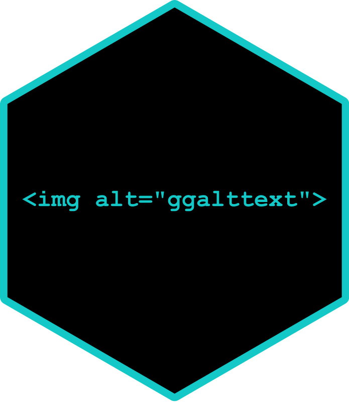

<!-- badges: start -->
  [](https://github.com/nrennie/ggalttext/actions)
<!-- badges: end -->

# ggalttext 

An R package for generating alt text from a ggplot object.

## Installation

Install using:
``` r
devtools::install_github("nrennie/ggalttext")
```
or
``` r
remotes::install_github("nrennie/ggalttext")
```

## Examples

``` r
library(ggplot2)
library(ggalttext)
g1 <- ggplot(data = mtcars,
            mapping = aes(x = mpg,
                          y = disp)) +
  geom_point()
generate_alt_text(g1)
```
